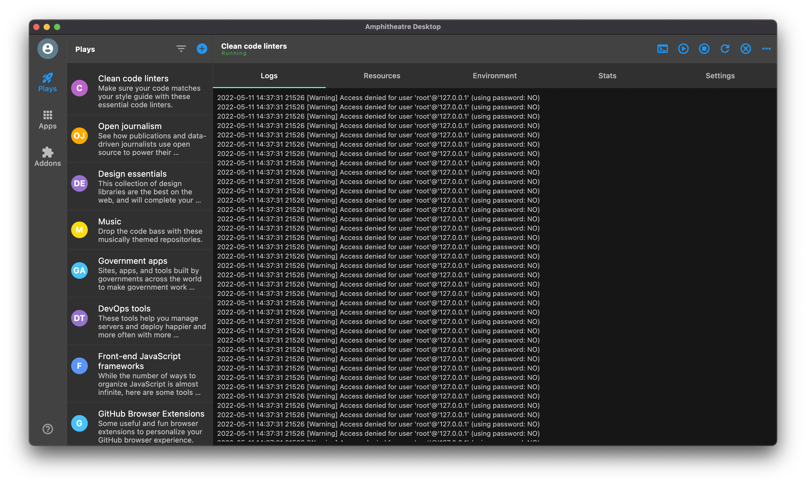

# Amphitheatre Desktop

Amphitheatre Desktop is an open source [Flutter](https://flutter.dev)-based
application that enables you to interact with Amphitheatre using a GUI instead
of the command line or a web browser. Amphitheatre Desktop encourages you and
your team to collaborate using best practices with Amphitheatre. You can use
Amphitheatre Desktop to facilitates continuous development of applications and
microservices. You can iterate your application source code locally, then deploy
to a local or remote Kubernetes cluster, just like docker build && kubectl apply
or docker-compose up.

## Getting Started

This project is a starting point for a Flutter application that follows the
[simple app state management
tutorial](https://flutter.dev/docs/development/data-and-backend/state-mgmt/simple).
For help getting started with Flutter, view Flutter's [online
documentation](https://flutter.dev/docs), which offers tutorials, samples,
guidance on mobile development, and a full API reference.

## Installation

If you're new to Flutter the first thing you'll need is to follow the [setup
instructions](https://flutter.dev/docs/get-started/install). Once you're set up
and can compile the sample Flutter app, you're ready to run this project!

Using your IDE of choice, open the root directory of project. Then, using the
terminal inside your IDE, run `flutter pub get` to fetch any dependencies, and
`flutter run` to deploy to your connected device or simulator.

If you would like to try these for Flutter for web, you can use `flutter run -d
chrome`. Note that Flutter for web is currently a technical preview and not all
of features will work correctly. For more information on enabling Flutter for
web follow the [setup instructions](https://flutter.dev/docs/get-started/web).

## Nightly Builds

Get the latest nightly builds of Amphitheatre Desktop [here](https://nightly.link/amphitheatre-app/desktop/workflows/snapshot/master)

## Localization

This project generates localized messages based on arb files found in the
`lib/src/localization` directory. To support additional languages, please visit
the tutorial on [Internationalizing Flutter
apps](https://flutter.dev/docs/development/accessibility-and-localization/internationalization)

## Contributing

If anything feels off, or if you feel that some functionality is missing, please
check out the [contributing
page](https://docs.amphitheatre.app/contributing/). There you will find
instructions for sharing your feedback, building the tool locally, and
submitting pull requests to the project.

## License

Amphitheatre Desktop is a free and open source software, it is licensed under
the [Apache License
2.0](https://github.com/amphitheatre-app/desktop/blob/master/LICENSE)
